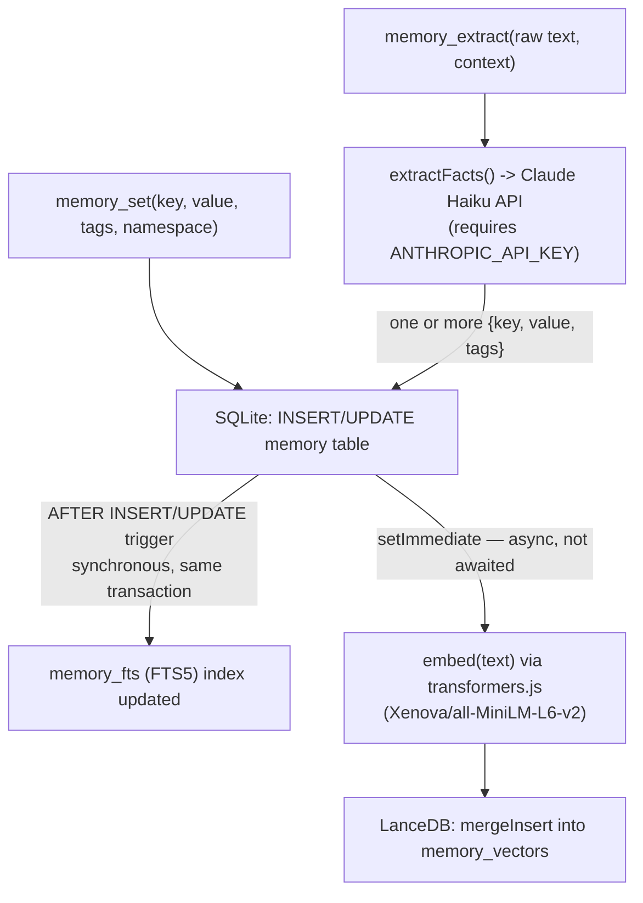
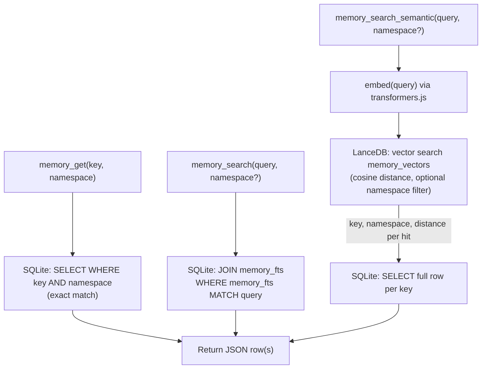

# How memories are set and retrieved

project-brain writes to two backing stores — SQLite (exact lookups + full-text search) and
LanceDB (semantic/vector search) — and keeps them in sync differently depending on the path.
That difference matters for what you can expect right after a write, so it's called out below.

## Writing

- **`memory_set`** is the direct path — one call, one fact, caller already knows the key/value.
- **`memory_extract`** fans into the same write path, just with an extra step first: raw text
  goes to Claude Haiku (`src/extract.ts`), which returns a JSON array of facts, each one then
  written exactly like a `memory_set` call.
- **The FTS index update is synchronous** — part of the same SQLite write, via triggers in
  `src/db.ts` (`memory_ai`/`memory_au`/`memory_ad`). A `memory_search` right after `memory_set`
  returns will find the new entry.
- **The vector upsert is asynchronous** — fired via `setImmediate` and not awaited by the tool
  handler, so the tool call returns before embedding finishes. There's a brief window
  (typically well under a second, longer on first use while the embedding model loads) where
  `memory_search_semantic` won't yet see a just-written fact, even though `memory_search`
  already does.

## Retrieving

- **`memory_get`** is a plain SQLite primary-key lookup — fastest path, only works if you
  already know the exact key.
- **`memory_search`** is SQLite FTS5 keyword matching — fast and precise, but only finds
  entries that share actual words with the query.
- **`memory_search_semantic`** embeds the query with the same model used at write time, does a
  vector similarity search in LanceDB, then joins back to SQLite per hit to fetch the full row
  (tags, source, timestamps) — LanceDB only stores `key`/`namespace`/`vector`/`text`, not the
  full record. This is the only path that can find conceptually related facts with no keyword
  overlap at all, at the cost of an extra embedding call and a second lookup per result.

See [`src/memory.ts`](../src/memory.ts), [`src/lance.ts`](../src/lance.ts), and
[`src/extract.ts`](../src/extract.ts) for the actual implementation.
